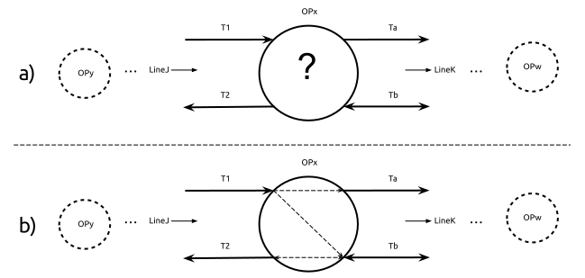

## Data Sources and Use Case
{:#base-registries}

In this section, we present an overview of the different
data sources reused by our proposed solution.
We also describe the RCC use case
as the main motivator for this work.

### ERA's base registries

Our approach considers, so far,
3 of the [base registries](https://www.era.europa.eu/registers_en) maintained by ERA,
namely the Register of Infrastructure (RINF),
the Register of Authorized Types of Vehicles (ERATV)
and the Centralized Virtual Vehicle Register (ECVVR).
These registries contain overlapping conceptual definitions,
represented as properties of different types of entities,
which are locked within their respective data silos.
Next, we give a brief description for each of these registries.

#### Register of Infrastructure

The European Register of Infrastructure (RINF)
was introduced following Article 35
of the EU regulation 2008/57/EC .
RINF contains the main features of fixed installations
related to the subsystems of infrastructure,
energy and parts of control-command and signaling.
It publishes performance and technical characteristics
mainly related to interfaces with rolling stock and operation.
It is maintained as a relational database
and its content is provided by the different European IMs,
by means of a predefined [XML Schema](https://www.era.europa.eu/sites/default/files/registers/docs/rinf_schema_en.xsd)[^rinf-xsd].

#### Register of Authorized Types of Vehicles

The European Register of Authorized Types of Vehicles (ERATV)
is introduced by Article 5 of the EU regulation 2011/665/EU .
It aims to publish and keep an up-to-date set of authorized types of vehicles
including information that references the technical specifications for each parameter.
ERATV is maintained as a relational database
populated through a Web application by multiple authorizing entities.
ERATV also provides additional information for a certain vehicle type,
such as manufacturing country, manufacturer, category
and different physical and operational parameters.

#### Centralized Virtual Vehicle Register
The European Centralised Virtual Vehicle Register (ECVVR)
is a base registry maintained by ERA,
in accordance with the EU regulation 2018/1614 .
ECVVR defines a decentralized architecture
for information search and retrieval of rolling stock data,
where each Member State hosts and publishes their own national vehicle registry(ies),
accessible through Web-based interfaces.

### External data source

There are known limitations for ERA's base registries,
as is the case of RINF and the limited granularity
it gives over the railway topology.
RINF provides a view over the railway infrastructure,
commonly referred to as meso-level view[^levels],
where complex topological structures inside stations, junctions, switches, etc.,
are abstracted into single nodes in the network graph.
Route calculations over this limited view,
may wrongfully assume certain direction changes,
not possible in the real world.
Calculating end-to-end routes with high accuracy,
requires further data about the connectivity within each network node.
This connectivity issue currently stands as one of the main challenges,
for an accurate and reliable data source
description of the European railway infrastructure topology.
For this reason, we also consider an external data source,
provided by the Dutch IM ProRail,
which provides an additional topological description
for addressing this issue limited to the region of Utrecht in The Netherlands.

#### Connectivity data in the Utrecht area
The Dutch IM ProRail, provided us with an additional data source
for exploring an alternative solution for the lack of real information
about the internal connectivity inside network nodes (also called operational points).
It consists of a table that groups all the different permutations of incoming
and outgoing tracks for a set of operational points, and states if they are connected or not.

<figure id="fig-1">

<figcaption>
a) shows a schematic diagram of an operational point where its internal connections are unknown.
b) shows how this information can be completed from the data provided in Table 1.
</figcaption>
</figure>

The operational point _OPx_ ([Figure 1a](#fig-1)),
has two incoming tracks (_T1_ and _T2_)
coming from _OPy_ and belonging to the national line _LineJ_.
We know these are incoming tracks
thanks to the logical direction defined for _LineJ_,
despite _T1_ being a bidirectional track.
_OPx_ also has two outgoing tracks (_Ta_ and _Tb_),
going towards _OPw_ and belonging to another national line _LineK_.
Based on this information, we establish
the correct connectivity that reflects real-world behavior.

<figure id="table-1" class="table" markdown="1">

| IN_Line | IN_OP | IN_Track  |  OP  | OUT_Track | OUT_OP | OUT_Line |       Connected       |
|:-------:|:-----:|:---------:|:----:|:---------:|:------:|:--------:|:--------------------: |
|  LineJ  |  OPy  |     T1    |  OPx |    Ta     |   OPw  |   LineK  | <strong>true</strong> |
|  LineJ  |  OPy  |     T1    |  OPx |    Tb     |   OPw  |   LineK  | <strong>true</strong> |
|  LineJ  |  OPy  |     T2    |  OPx |    Ta     |   OPw  |   LineK  | <strong>false</strong>|
|  LineJ  |  OPy  |     T2    |  OPx |    Tb     |   OPw  |   LineK  | <strong>true</strong> |

<figcaption markdown="block">
All the possible permutations
between incoming and outgoing tracks of OPx,
plus a column that states if there is a possible connection between two pairs of tracks.
</figcaption>
</figure>

### Use Case: Route Compatibility Check

Article 23 (point b) of the European regulation 2016/797 stipulates  that:

"_Before a railway undertaking uses a vehicle in the area of use specified in its authorisation for placing on the market, it shall check: ...(b) that the vehicle is compatible with the route on the basis of the infrastructure register, the relevant TSIs or any relevant information to be provided by the infrastructure manager free of charge and within a reasonable period of time, where such a register does not exist or is incomplete_"

The specific procedures for assessing
if a certain vehicle is compatible with a certain route,
are further specified by the Annex D1
of the EU regulation 2019/773 .
These specifications directly refer to
specific data properties within RINF and ERATV,
of 22 different technical aspects
that need to be compared to determine if there is technical compatibility.
This specification already highlights a clear need for interoperability
at least between RINF and ERATV,
which we address with the proposed ontology and derived Knowledge Graph.

To determine if a certain vehicle type
is compatible with a certain route,
is necessary to first find possible routes through the railway infrastructure,
which involves a very particular type of queries,
namely graph pathfinding queries.
The standard query language for RDF graphs (SPARQL)
does not support finding complex relation paths between RDF entities .
The Property Paths querying syntax, introduced in SPARQL 1.1,
only allows for testing path existence
but falls short on counting and retrieving the actual paths between two nodes ,
which is crucial for the RCC use case.
Currently there exist non-standard extensions to SPARQL (e.g. [Stardog path queries](https://docs.stardog.com/archive/7.5.0/query-stardog/path-queries)[^stardog])
that address this limitation they are not widely supported across RDF graph databases.
We consider this limitation in our proposed architecture
and propose an alternative solution (see [Section 4.2](#architecture)) to non-standard SPARQL extensions
and according to the current Web standards to prevent vendor lock-in issues.

[^rinf-xsd]: <a href="https://www.era.europa.eu/sites/default/files/registers/docs/rinf_schema_en.xsd">https://www.era.europa.eu/sites/default/files/registers/docs/rinf_schema_en.xsd</a>

[^levels]: See section 1.6 of  for a description of railway vie levels.

[^res-codes]: <a href="https://www.era.europa.eu/sites/default/files/registers/docs/list_harmonised_national_restriction_codes_en.pdf">https://www.era.europa.eu/sites/default/files/registers/docs/list_harmonised_national_restriction_codes_en.pdf</a>

[^rsdr]: <a href="https://www.era.europa.eu/sites/default/files/events-news/docs/rsrds_taf_tsi_032018_en.pdf">https://www.era.europa.eu/sites/default/files/events-news/docs/rsrds_taf_tsi_032018_en.pdf</a>

[^stardog]: <a href="https://docs.stardog.com/archive/7.5.0/query-stardog/path-queries">https://docs.stardog.com/archive/7.5.0/query-stardog/path-queries</a>