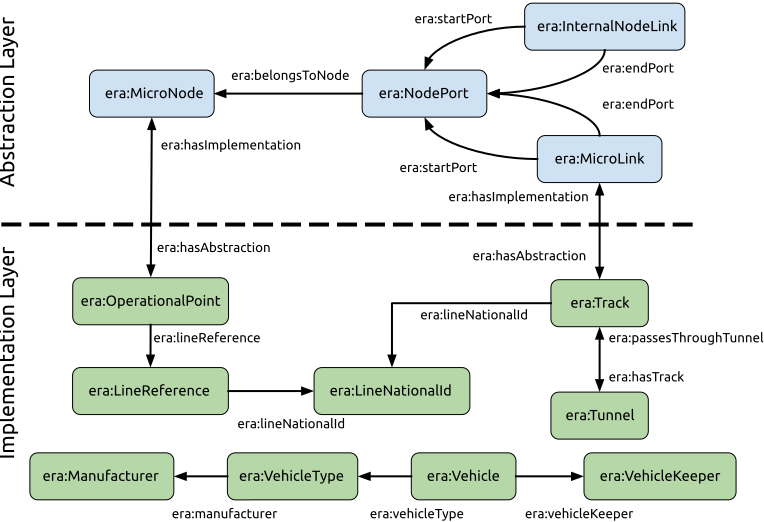
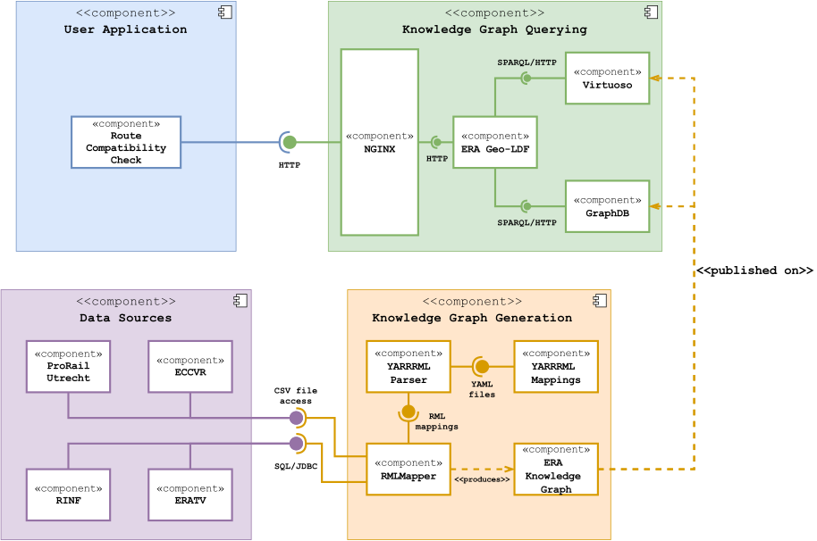
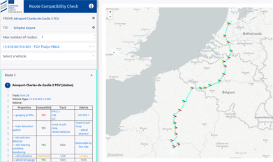

## Proposed Solution
{:#proposed-solution}

Considering the interoperability obstacles that exist among
the base registries maintained by ERA,
we propose and design a solution architecture,
capable of creating a semantic interoperability layer
for data integration over them.
Moreover, we exploit the inherent flexibility
of graph-based data models to also include an external data source,
that enriches the resulting Knowledge Graph (KG)
and addresses intrinsic limitations of the original base registries.
The proposed architecture relies on an ontology,
defined to cover, but not limited to,
the explicit interoperability requirements brought forth by the RCC use case.
The architecture implements an ETL (Extract Transform Load)-based pipeline
that relies on a fully declarative approach
for the KG generation process,
and leverages fundamental Web principles such as caching,
to reduce computational infrastructure costs
while maintaining a high querying flexibility.

In this section, we present a description
of the main architectural components of our proposed solution.
We describe the proposed ontology and
give a full overview of the solution architecture,
which includes a fully functional application to support
route compatibility checks ([available online](http://era.ilabt.imec.be/test/compatibility-check-demo/)[^era-rcc]).

### The ERA Vocabulary

Our proposed ontology, namely the [ERA Vocabulary](http://era.ilabt.imec.be/era-vocabulary/index-en.html)[^era-ontology],
was created in a collaborative effort including
domain experts from ERA, ProRail, SNCF
and Semantic Web experts from DG DIGIT and IDLab-imec.
The ERA Vocabulary provides unique identifiers
and semantic definitions for concepts and properties, common to the railway domain.
We make its documentation available online
using Widoco  as a template generator.
The source files are available in a public [GitHub repository](https://github.com/julianrojas87/era-vocabulary/tree/master)[^era-vocab].

<figure id="fig-2">

<figcaption>
Layered data model of the ERA Vocabulary.
</figcaption>
</figure>

Following Semantic Web best practices,
the ontology reuses external ontologies such as
OGC GeoSPARQL, Schema.org and
the EU publications office [authority table](http://publications.europa.eu/resource/authority/country)[^country] for country definitions.
It defines a layered model (see [Figure 2](#fig-2)),
inspired from RINF's relational model,
where the topological and functional aspects of the railway infrastructure
are defined by independent entity types.
Two layers are defined: _abstraction_ and _implementation_.
The _abstraction_ layer defines logical entities
form the network topology graph, with _era:NodePorts_ acting as nodes
and both _era:MicroLinks_ and _era:InternalNodeLinks_  acting as edges.
The _implementation_ layer, represents concrete
and functional objects in the real world, such as tracks,
operational points (stations, switches, etc.) and vehicles (types).
The link between these two layers is given by
the _era:MicroNode_ - _era:OperationalPoint_ and _era:MicroLink_ - _era:Track_ relationships.  

Additionally, 28 [reference datasets](http://era.ilabt.imec.be/era-vocabulary/era-skos#)[^era-skos]
were extracted from the base registries
and defined as SKOS controlled vocabularies.
They contain definitions for different domain-related technical aspects,
which are envisioned to be independently managed by relevant authorities.

### Architecture Overview
{:#architecture}

Our proposed solution architecture is composed by 4 main modules (see [Figure 3](#fig-3)),
namely the _Data Sources_, _KG Generation_, _KG Querying_ and _User Application_ modules.
The _Data Sources_ module represents the considered data sources
(previously described in [Section 3](#base-registries)).
The components from the _KG Generation_ module,
access the data sources to produce the RDF triples that compose the ERA KG.
The ERA KG is published and made available for querying by the _KG Querying_ module,
which provides the necessary interfaces
for the _User Application_ module to support specific use cases.
Next, we provide a description and the rationale behind these modules.

<figure id="fig-3">

<figcaption>
Overview of the proposed solution architecture
for semantic data interoperability across ERA's base registries.
</figcaption>
</figure>

#### KG Generation
The KG generation process in our solution
follows an ETL-based approach and uses the RML  technology stack
for declaratively generating the RDF triples of the ERA Knowledge Graph.
RML was selected for handling heterogeneous data sources,
which in our case are relational DBs and CSV files,
but XML Schema-based data sources (e.g., RailML) are also envisioned as a next step.
The steps followed in this process are:

1. The declarative RDF [mapping rules](https://github.com/julianrojas87/era-data-mappings)[^mappings] specified in human-friendly YARRRML  syntax.
2. YARRRML rules are transformed to RML using the yarrrml-parser Node.js application.
3. The [RMLMapper](https://github.com/RMLio/rmlmapper-java)[^rml-mapper], a Java application that reads the specified data sources and produces RDF data according to the set of given rules.
4. The resulting KG is published and loaded in a triple store. At the time of writing the ERA KG, had a total of 13.8 million triples, which we also make available as a [raw data dump](https://drive.google.com/file/d/1KofPzYx2ovgAz85rLuO5J98SEs2BjWbO/view?usp=sharing)[^raw-kg].

#### KG Querying
We published the ERA KG in two different triple stores ([GraphDB](http://era.ilabt.imec.be/sparql)[^graphdb] and [Virtuoso](https://linked.ec-dataplatform.eu/sparql?default-graph-uri=https%3A%2F%2Flinked.ec-dataplatform.eu%2Fera)[^virtuoso])
to prove that our proposed solution is vendor-independent.
This module includes one of the core components of the architecture:
the ERA Geo-LDF, which is implemented as a [Node.js application](https://github.com/julianrojas87/era-ldf/)[^geo-ldf].
The main purpose of this component is exposing a Linked Data
and Hypermedia-based API over the ERA KG.
It builds on the Linked Data Fragments  approach
to provide metadata annotated fragments (tiles) of the ERA KG,
based on a predefined geospatial pattern.
It follows the [slippy maps specification](https://wiki.openstreetmap.org/wiki/Slippy_map_tilenames)[^slippy],
where the grid-based partition of the world
is specified based on a zoom level _z_ and the _x_ and _y_ cartesian coordinates.
A live example of a tile for the area of Brussels can be accessed on [http://era.ilabt.imec.be/ldf/sparql-tiles/implementation/10/524/343](http://era.ilabt.imec.be/ldf/sparql-tiles/implementation/10/524/343).

The tiles are built by the ERA Geo-LDF component via
template SPARQL queries that select and filter the entities
based on their geospatial properties.
In this way, client applications can request relevant data
for their purposes, and since the API returns unmodified triples from the KG,
further querying and processing becomes possible on the client-side.
Following this approach, we address the limitation
of performing graph pathfinding queries directly on the SPARQL endpoints.
Our client application implements a shortest-path algorithm
and proceeds to download the relevant tiles based on
the geospatial information given by origin-destination queries.
Furthermore, tiles can be cached both on client- and server-side,
which reduces the overall computational load on the server
and improves query performance for client applications.

#### User Application
This module represents any user-oriented applications
that would perform querying tasks over the ERA KG to support a given use case.
So far, we developed a [React-based Web application](https://github.com/julianrojas87/era-compatibility-check)[^era-ui]
for supporting the RCC use case
and demonstrating the achieved data interoperability via the ERA KG.
The application allows users to select
an origin-destination pair of operational points (visible in map-based UI)
to calculate one or more possible routes between them.
Once selected, it proceeds to download the relevant KG tile fragments
and perform the pathfinding process.
It handles RDF triples natively and implements the A*  and Yen's  algorithms
for graph shortest path and top-k shortest path calculations respectively.
Once a route is found, users may select a vehicle type or also a specific vehicle instance,
for which the compatibility checks will be performed.
Currently, the application implements compatibility evaluation
for 15 different parameters of both track sections and vehicle (types).
The users can also visualize the internal connectivity
inside the operational points that form part of a calculated route,
by means of a schematic diagram,
that shows the possible internal connections defined in the ERA KG.
This feature is particularly interesting for operational points
around the city of Utrecht in The Netherlands,
considering the additional data source from ProRail ([Section 3](#base-registries)),
that was integrated into the KG.

<figure id="fig-4">

<figcaption>
Screenshot of the RCC Web application showing a route calculated from the <a href="https://linked.ec-dataplatform.eu/describe/?url=http%3A%2F%2Fera.europa.eu%2Fimplementation%23OP_FR0000003173">Charles de Gaulle airport</a> in Paris to the <a href="https://linked.ec-dataplatform.eu/describe/?url=http%3A%2F%2Fera.europa.eu%2Fimplementation%23OP_NLSHL">Schipol airport</a> in Amsterdam. On the lower left panel, the results of the compatibility check process are shown for the <a href="https://linked.ec-dataplatform.eu/describe/?url=http%3A%2F%2Fera.europa.eu%2Fimplementation%23VT_13-018-0013-0-001">TGV Thalys PBKA</a> vehicle type.
</figcaption>
</figure>

[^era-rcc]: <a href="http://era.ilabt.imec.be/test/compatibility-check-demo/">http://era.ilabt.imec.be/test/compatibility-check-demo/</a>

[^era-vocab]: <a href="https://github.com/julianrojas87/era-vocabulary/tree/master">https://github.com/julianrojas87/era-vocabulary/tree/master</a>

[^era-skos]: <a href="http://era.ilabt.imec.be/era-vocabulary/era-skos#">http://era.ilabt.imec.be/era-vocabulary/era-skos#</a>

[^country]: <a href="http://publications.europa.eu/resource/authority/country">http://publications.europa.eu/resource/authority/country</a>

[^mappings]: <a href="https://github.com/julianrojas87/era-data-mappings">https://github.com/julianrojas87/era-data-mappings</a>

[^rml-mapper]: <a href="https://github.com/RMLio/rmlmapper-java">https://github.com/RMLio/rmlmapper-java</a>

[^raw-kg]: <a href="https://drive.google.com/file/d/1KofPzYx2ovgAz85rLuO5J98SEs2BjWbO/view?usp=sharing">https://drive.google.com/file/d/1KofPzYx2ovgAz85rLuO5J98SEs2BjWbO/view?usp=sharing</a>

[^graphdb]: <a href="http://era.ilabt.imec.be/sparql">http://era.ilabt.imec.be/sparql</a>

[^virtuoso]: <a href="https://linked.ec-dataplatform.eu/sparql?default-graph-uri=https%3A%2F%2Flinked.ec-dataplatform.eu%2Fera">https://linked.ec-dataplatform.eu/sparql?default-graph-uri=https%3A%2F%2Flinked.ec-dataplatform.eu%2Fera</a>

[^geo-ldf]: <a heref="https://github.com/julianrojas87/era-ldf/">https://github.com/julianrojas87/era-ldf/</a>

[^slippy]: <a href="https://wiki.openstreetmap.org/wiki/Slippy_map_tilenames">https://wiki.openstreetmap.org/wiki/Slippy_map_tilenames</a>

[^era-ui]: <a href="https://github.com/julianrojas87/era-compatibility-check">https://github.com/julianrojas87/era-compatibility-check</a>